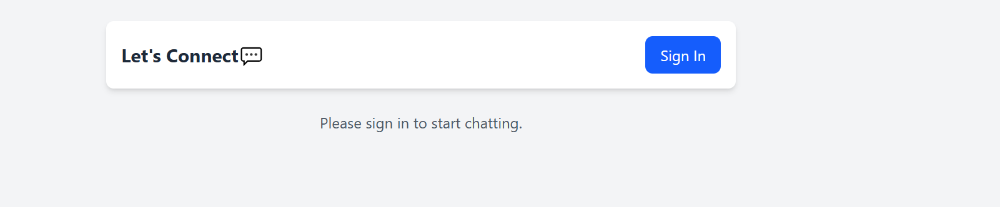
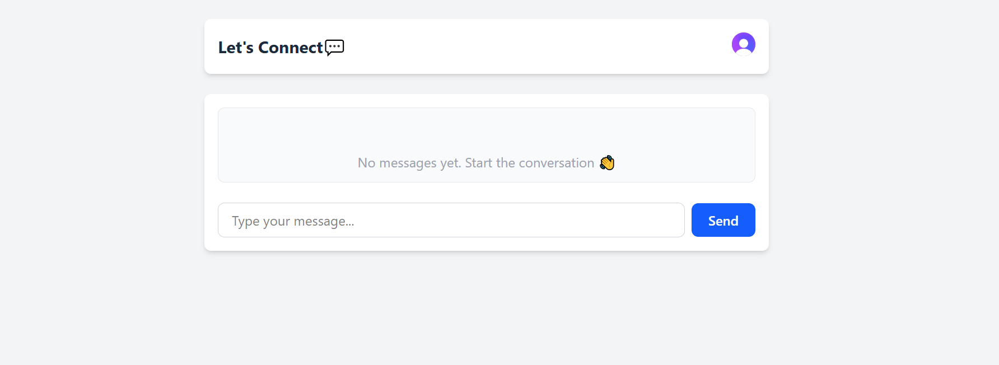

# Real-Time Chat Application with Socket.io

This is a real-time chat application using Socket.io, implementing bidirectional communication between clients and server.

## Project Structure

```
socketio-chat/
├── client/                 # React front-end
│   ├── public/             # Static files
│   ├── src/                # React source code
│   │   ├── components/     # UI components
│   │   ├── context/        # React context providers
│   │   ├── hooks/          # Custom React hooks
│   │   ├── pages/          # Page components
│   │   ├── socket/         # Socket.io client setup
│   │   └── App.jsx         # Main application component
│   └── package.json        # Client dependencies
├── server/                 # Node.js back-end
│   ├── config/             # Configuration files
│   ├── controllers/        # Socket event handlers
│   ├── models/             # Data models
│   ├── socket/             # Socket.io server setup
│   ├── utils/              # Utility functions
│   ├── server.js           # Main server file
│   └── package.json        # Server dependencies
└── README.md               # Project documentation
```

## 🛠️ Setup
1. Make sure you have Node.js installed (v18+ recommended)
2. Clone the repository
3. Install server dependencies:
   ```
   cd server
   npm install
   ```
4. Install client dependencies:
   ```
   cd client
   npm install
   ```
5. Start the development servers:
   ```
   # In the server directory
   npm run dev
   
   # In the client directory
   npm run dev
   ```

## Requirements

- Node.js (v18 or higher)
- npm or yarn
- Modern web browser
- Basic understanding of React and Express

## Screenshots




## Resources

- [Socket.io Documentation](https://socket.io/docs/v4/)
- [React Documentation](https://react.dev/)
- [Express.js Documentation](https://expressjs.com/)
- [Building a Chat Application with Socket.io](https://socket.io/get-started/chat) 